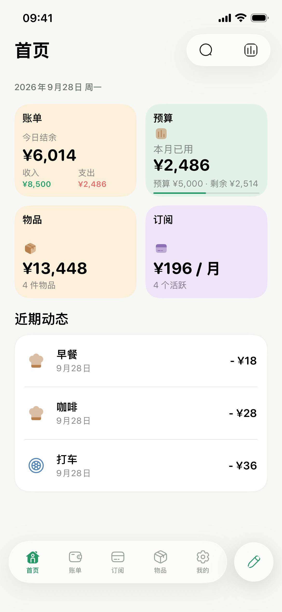
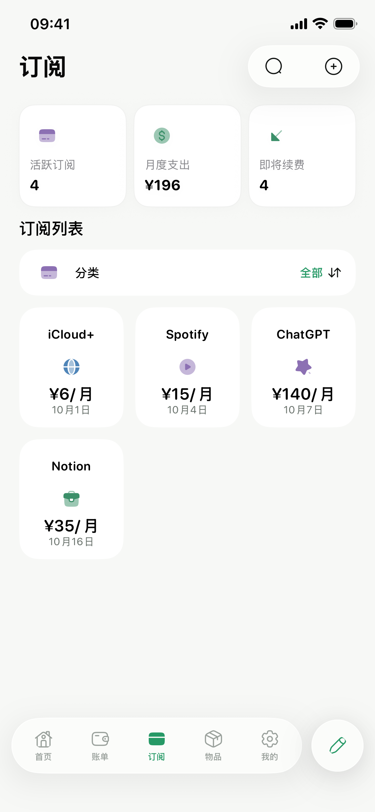
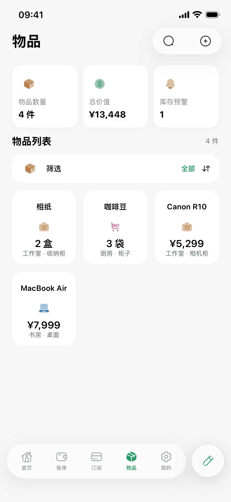
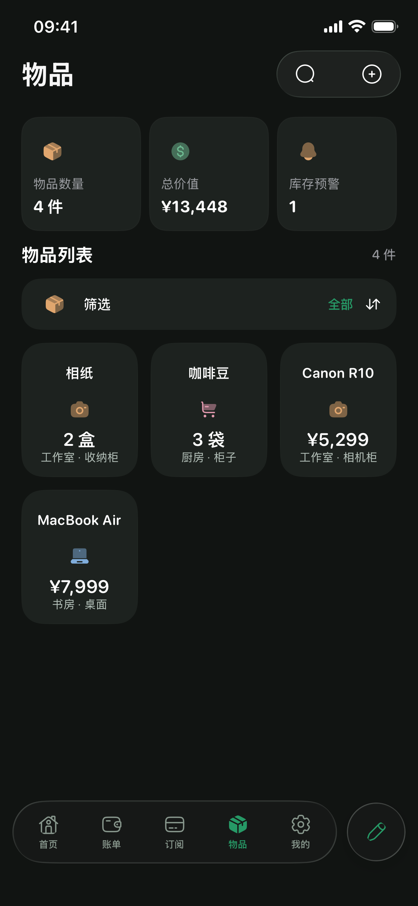
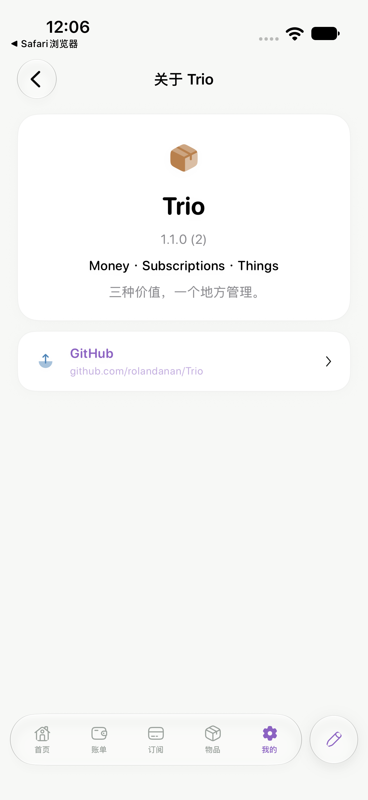

  

<h1 align="center">Trio</h1>

  <strong>Money · Subscriptions · Things</strong> 
  三种价值，一个地方管理。 
  一款本地优先的 iOS 账单、订阅与物品管理 App。

  
  
  

  <a href="https://github.com/rolandanan/Trio/releases/latest">下载最新版本</a> ·
  <a href="#一个-app管理三种价值">功能介绍</a> ·
  <a href="docs/INSTALLATION.md">安装说明</a> ·
  <a href="CHANGELOG.md">更新日志</a>

## 一个 App，管理三种价值

### 💰 Money

记录收入与支出，按周、月、年查看账单，管理分类与预算。

### 💳 Subscriptions

集中查看周期费用、续费日期和月度订阅支出。

### 📦 Things

记录物品的购买价格、当前价值、库存和位置，并与账单关联。

### 产品截图

以下画面来自 iPhone 17e 和 iPhone Air 模拟器；业务页面均使用虚构演示数据。

  
  
  

  
  
  

## 为什么是 Trio

记账告诉你钱花到哪里。Trio 还帮助你看清：

- **Money**：钱是怎么流动的。
- **Subscriptions**：哪些支出会持续发生。
- **Things**：花出去的钱最终变成了什么。

**Money · Subscriptions · Things**，三种价值，一个地方管理。

## 功能

| 模块 | 功能 |
| --- | --- |
| 💰 账单 | 收入、支出、分类、周／月／年周期与报表 |
| 🎯 预算 | 月预算、本月已用与剩余额度 |
| 💳 订阅 | 周期费用、续费日期与月度订阅支出 |
| 📦 物品 | 购买价格、当前价值、分类与状态 |
| 📍 位置 | 自定义放置位置 |
| 📊 库存 | 数量、单位、最低库存与出入库流水 |
| 🔗 关联 | Money 账单与 Things 物品关联 |
| 🌙 外观 | 浅色与深色模式 |
| ℹ️ 关于 | 动态版本号、App 介绍与 GitHub 链接 |

## 下载

当前版本：**Trio v1.1.0（Build 2）**

### [⬇️ 下载最新 Trio IPA](https://github.com/rolandanan/Trio/releases/latest)

当前公开 IPA 未签名，需要使用合法可用的签名方式安装。详见[安装说明](docs/INSTALLATION.md)。

## 安装

下载后请先阅读[安装说明](docs/INSTALLATION.md)，确认签名方式及设备要求；未签名 IPA 不能直接点击安装。

## 隐私

Trio 是本地优先的 App。账单、订阅、物品和库存等用户数据保存在用户设备上。公开 GitHub 仓库不要求上传个人数据库，也不会要求提供 Apple ID 密码、证书私钥或签名文件。

提交 Issue 时，请勿上传真实账单、数据库备份、Apple ID、证书、设备 UDID 或其他个人信息。详见[隐私说明](PRIVACY.md)与[安全提示](SECURITY.md)。

## Official Releases

只有本仓库的 [GitHub Releases](https://github.com/rolandanan/Trio/releases) 发布的文件属于 Trio 官方版本。第三方 Fork、重新打包、重新签名或修改版均不属于官方 Trio Release。

## 版权

© 2026 Trio。详见 [LICENSE](LICENSE)。
